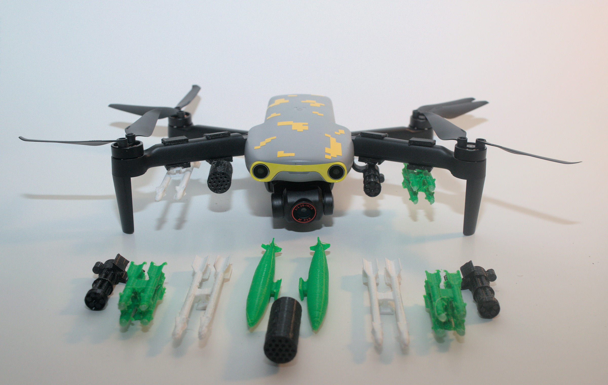
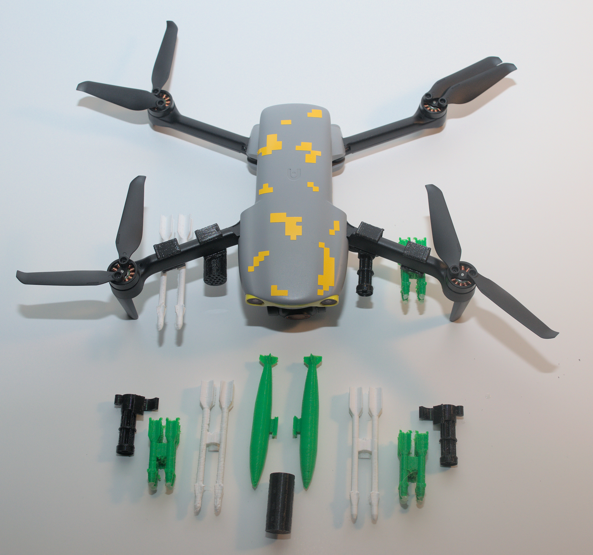
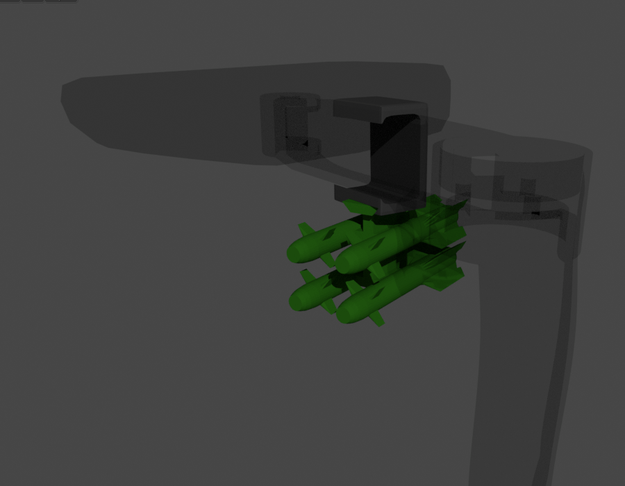

# 3D Printable Up-Armor Kit for Drones 
Because why not? 

*Not intended to be used during flight but you will anyway.*

| Front | Top |
| --- | --- | 
|  |  |

## Features
Dovetail mounting slots to mix and match your loadout
### Mounts
  * Autel Nano Plus
  * DJI Mini 2 
### Attachments
  * Miniguns
  * Rocket Pods
  * AGM-114 (Hellfire)
  * AIM-9 (Sidewinder)
  * Mark 84

## Instructions 
  * Print upright
  * Supports: Touching build plate
  * Raft: (on the tall stuff)
  * Cooling: yes

